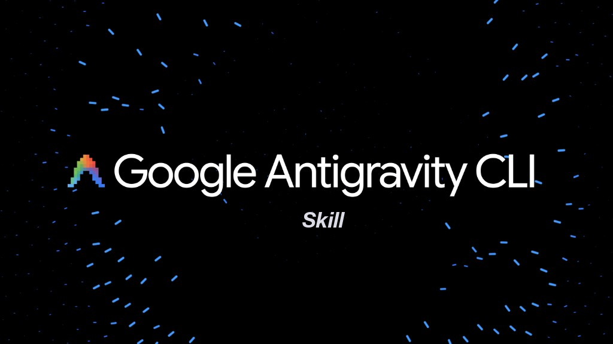

<p align="center">
  
</p>

# Antigravity CLI (agy) Skill

[](https://github.com/jacob-bd/universal-skills-manager)
[](https://github.com/jacob-bd/antigravity-cli-skill/stargazers)
[](https://makeapullrequest.com)

> ☕ **If you find this skill useful, consider [buying me a coffee](https://buymeacoffee.com/jacobbd).**
> It's free and built in my spare time. A coffee helps me cover my time and keep shipping updates. Thank you! 🙏
>
> <a href="https://buymeacoffee.com/jacobbd"></a>

An AI agent skill for working with Google's Antigravity CLI (`agy`) -- the official successor to Gemini CLI.

## What This Is

This is a skill file that teaches AI coding agents (Claude Code, Gemini CLI, Codex, Cursor, etc.) how to use the `agy` command-line tool effectively. It covers:

- Complete flag reference for agy v1.1.8
- Supported capabilities and automation patterns (NDJSON output streaming, reasoning effort control, Markdown agents)
- Gemini CLI to agy migration guide and flag mapping
- Best practices for automation and scripting
- Troubleshooting common issues

## Background

Google announced at I/O 2026 (May 19) that Gemini CLI is transitioning to Antigravity CLI. Consumer/free users lose Gemini CLI access on June 18, 2026. The `agy` CLI is a Go binary that shares the same agent harness as the Antigravity IDE desktop application.

## Files

| File | Description |
| :--- | :--- |
| `SKILL.md` | Main skill definition -- install this in your AI tool |
| `resources/cheat_sheet.md` | Quick reference card with all flags and migration mapping |
| `examples/usage_patterns.md` | Common usage patterns with runnable examples |

## Installation

Copy or symlink `SKILL.md` to your AI tool's skill directory:

```bash
# Claude Code
cp SKILL.md ~/.claude/skills/antigravity-cli/SKILL.md

# Gemini CLI
cp SKILL.md ~/.gemini/skills/antigravity-cli/SKILL.md

# Or install via Universal Skills Manager if available
```

## Status

This skill tracks locally installed agy v1.1.8.

## Support

If this skill saves you time or money, you can help support its development. Any support is hugely appreciated. 🙏

<a href="https://buymeacoffee.com/jacobbd"></a>
